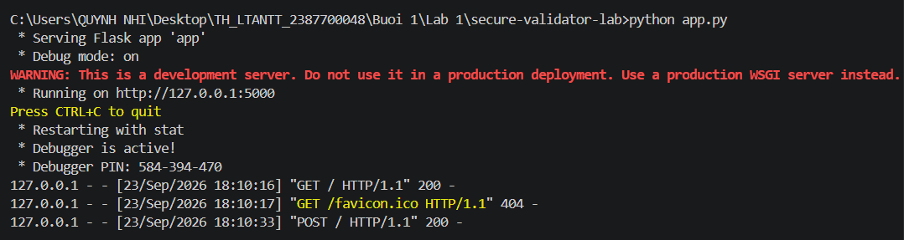
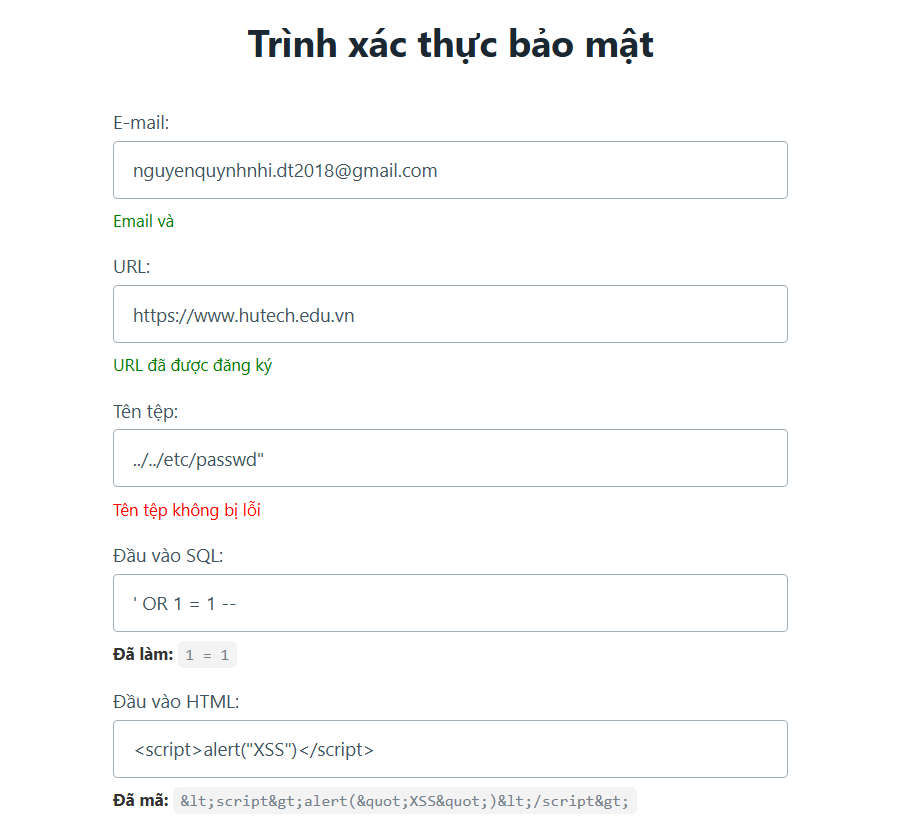

# Báo cáo Kiểm thử và Phân tích Payload - Ứng dụng SecureValidator

Tài liệu này tổng hợp các kịch bản kiểm thử (Test Case), kỹ thuật bảo mật được áp dụng và giải thích chi tiết cơ chế hoạt động của các payload tấn công dựa trên kết quả thực tế từ giao diện **Trình xác thực bảo mật**[cite: 10].

---

## 1. Bảng Kịch bản Kiểm thử (Test Cases) & Kết quả Thực tế

| STT | Trường / Chức năng | Dữ liệu Đầu vào (Payload / Input) | Mục đích Kiểm thử | Kết quả Thực tế trên Giao diện[cite: 10] | Trạng thái |
| :-- | :-- | :-- | :-- | :-- | :-- |
| 1 | **E-mail** | `nguyenquynhnhhi.dt2018@gmail.com`[cite: 10] | Kiểm tra tính hợp lệ của định dạng email | Email hợp lệ (Hiển thị thông báo xanh)[cite: 10] | Thành công |
| 2 | **URL** | `https://www.hutech.edu.vn`[cite: 10] | Kiểm tra cấu trúc URL và ngăn chặn SSRF | URL đã được đăng ký[cite: 10] | Thành công |
| 3 | **Tên tệp (Filename)** | `../../etc/passwd`[cite: 10] | Kiểm tra khả năng chống tấn công Path Traversal | Tên tệp không bị lỗi (Bị chặn/Từ chối)[cite: 10] | Thành công |
| 4 | **Đầu vào SQL** | `' OR 1 = 1 --`[cite: 10] | Kiểm tra khả năng lọc và chống SQL Injection | Đã lọc: `1 = 1`[cite: 10] | Thành công |
| 5 | **Đầu vào HTML** | ``[cite: 10] | Kiểm tra khả năng chống tấn công XSS | Đã mã: `&lt;script&gt;alert(&quot;XSS&quot;)&lt;/script&gt;`[cite: 10] | Thành công |

---

## 2. Kỹ thuật Được Sử dụng và Giải thích Chi tiết Payload

### 2.1. Kỹ thuật Xác thực Định dạng (Validation)
* **Trường áp dụng:** E-mail và URL[cite: 10].
* **Kỹ thuật:** Sử dụng biểu thức chính quy (Regex) và các hàm phân tích cú pháp tiêu chuẩn.
* **Ý nghĩa:** Đảm bảo dữ liệu người dùng nhập vào phải tuân thủ đúng cấu trúc quy định (ví dụ: email phải có cấu trúc `tên@tên_miền`, URL phải dùng giao thức an toàn `https`).

### 2.2. Kỹ thuật Duyệt Đường dẫn Cục bộ (Path Traversal)
* **Payload:** `../../etc/passwd`[cite: 10]
* **Kỹ thuật sử dụng:** Lợi dụng các ký tự điều hướng thư mục (`../`) để ép hệ thống đọc các tệp tin hệ thống nhạy cảm nằm ngoài thư mục cho phép.
* **Tại sao payload này nguy hiểm:** Trên hệ điều hành Linux, tệp `/etc/passwd` chứa danh sách tài khoản người dùng của hệ thống. Nếu ứng dụng web nhận chuỗi này và truyền trực tiếp vào hàm đọc tệp mà không kiểm tra, kẻ xấu có thể đánh cắp các thông tin cấu hình quan trọng.
* **Kết quả xử lý:** Hệ thống đã kiểm tra và chặn đứng payload này, trả về trạng thái không hợp lệ[cite: 10].

### 2.3. Kỹ thuật Tiêm nhiễm Câu lệnh Cơ sở Dữ liệu (SQL Injection)
* **Payload:** `' OR 1 = 1 --`[cite: 10]
* **Kỹ thuật sử dụng:** Thao túng logic của câu lệnh truy vấn SQL thông qua việc chèn các ký tự đặc biệt và từ khóa logic.
* **Cơ chế hoạt động giải thích tại sao tấn công được:**
  * Dấu nháy đơn (`'`) dùng để ngắt (đóng) chuỗi đầu vào trong câu lệnh SQL của ứng dụng.
  * Biểu thức `OR 1 = 1` luôn trả về giá trị Đúng (True), làm cho điều kiện truy vấn bị vô hiệu hóa và trả về toàn bộ dữ liệu trong bảng thay vì lọc theo dữ liệu thực tế.
  * Dấu `--` là ký tự chú thích (comment) trong SQL, giúp vô hiệu hóa toàn bộ phần câu lệnh còn lại ở phía sau.
* **Kết quả xử lý:** Hệ thống đã lọc sạch các ký tự nguy hiểm (`'`, `--`), chỉ giữ lại phần giá trị an toàn là `1 = 1`[cite: 10].

### 2.4. Kỹ thuật Kịch bản Chéo Trạng (Cross-Site Scripting - XSS)
* **Payload:** ``[cite: 10]
* **Kỹ thuật sử dụng:** Chèn mã nguồn thực thi (JavaScript) vào các trường dữ liệu hiển thị trên trang web.
* **Cơ chế hoạt động giải thích tại sao tấn công được:** Nếu ứng dụng nhận chuỗi này và hiển thị trực tiếp lên HTML mà không qua mã hóa, trình duyệt của người dùng sẽ hiểu lầm đây là mã lệnh script hợp lệ và thực thi nó (hiện bảng thông báo `alert`). Kẻ tấn công có thể lợi dụng điều này để chiếm đoạt phiên làm việc (session) hoặc đánh cắp cookie.
* **Kết quả xử lý:** Hệ thống đã thực hiện mã hóa HTML (`HTML Escape`), chuyển đổi các ký tự nhạy cảm như `<` thành `&lt;`, `"` thành `&quot;`, khiến trình duyệt chỉ hiển thị dưới dạng văn bản thuần túy an toàn[cite: 10].
### Hình ảnh kết quả

