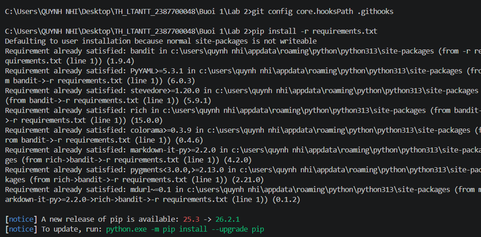
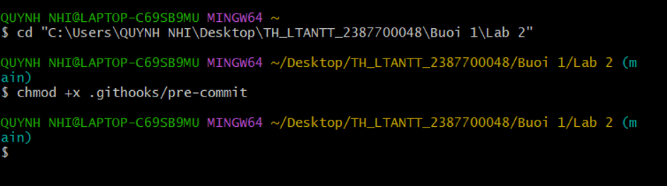
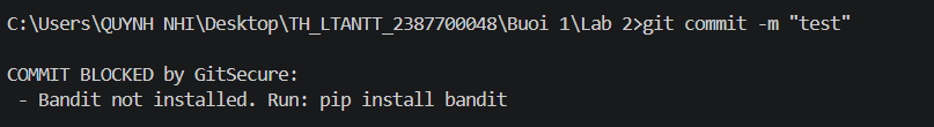
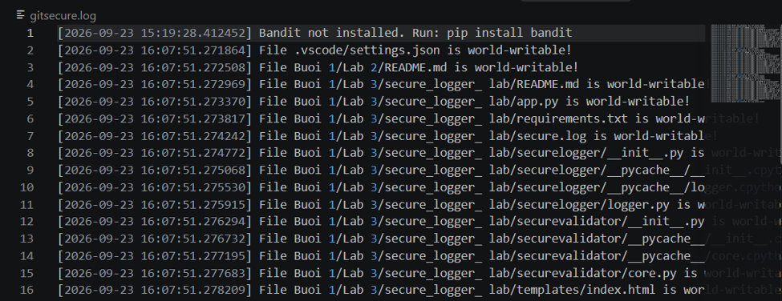

Tài liệu này tổng hợp cấu hình, các kịch bản kiểm thử (Test Case), cơ chế kiểm tra bảo mật và giải thích kỹ thuật dựa trên kết quả thực tế từ quá trình vận hành Git Hook trên hệ thống[cite: 10, 11, 12, 13].

---

## 1. Tổng quan Thiết lập Môi trường & Git Hook

* **Cấu hình đường dẫn Hook:** Thiết lập thư mục chứa git hooks tùy chỉnh bằng lệnh `git config core.hookPath .githooks`.
* **Phân quyền thực thi:** Cấp quyền thực thi cho tệp kịch bản `pre-commit` bằng lệnh `chmod +x .githooks/pre-commit` trên môi trường tương thích.

---

## 2. Kỹ thuật và Cơ chế Hoạt động của GitSecure

### 2.1. Kỹ thuật Kiểm tra Quyền Hạn Tệp (File Permissions Check)
* **Đoạn mã cốt lõi:**
  ```python
  def check_permissions(file_path):
      if platform.system() == "Windows":
          return False
      st = os.stat(file_path)
      if st.st_mode & stat.S_IWOTH:
          return f"File {file_path} is world-writable!"
      return None
# Báo cáo Kỹ thuật và Kịch bản Kiểm thử GitSecure Hook

Tài liệu này trình bày chi tiết về kỹ thuật kiểm tra quyền hạn, kỹ thuật quét bảo mật tĩnh và các kịch bản kiểm thử thực tế của hệ thống Git Hook.

---

## 2. Kỹ thuật và Cơ chế Hoạt động của GitSecure

### 2.1. Kỹ thuật Kiểm tra Quyền Hạn Tệp (File Permissions Check)
* **Giải thích kỹ thuật:** 
  * Hàm `check_permissions` kiểm tra hệ điều hành đang chạy; nếu là **Windows**, hàm bỏ qua việc kiểm tra phân quyền rườm rà (`return False`).
  * Trên các hệ thống khác, hàm sử dụng `os.stat()` kết hợp với toán tử bitwise `& stat.S_IWOTH` để kiểm tra xem tệp có đang mở quyền cho phép bất kỳ ai cũng có thể ghi (`world-writable`) hay không. Nếu phát hiện, hệ thống sẽ trả về cảnh báo bảo mật.

### 2.2. Kỹ thuật Quét Bảo mật Tĩnh (Static Application Security Testing - SAST)
* Sử dụng công cụ **Bandit** để phân tích mã nguồn Python nhằm tìm kiếm các lỗ hổng bảo mật tiềm ẩn trước khi cho phép mã nguồn được đưa vào lịch sử commit.

---

## 3. Kịch bản Kiểm thử (Test Cases) & Kết quả Thực tế

| STT | Tên Kịch bản (Test Case) | Dữ liệu / Thao tác Thực hiện | Mục đích Kiểm thử | Kết quả Thực tế trên Hệ thống | Trạng thái |
| :-- | :-- | :-- | :-- | :-- | :-- |
| 1 | **Cấu hình Hook & Thư viện** | Chạy `git config core.hookPath .githooks` và kiểm tra gói `bandit`. | Thiết lập môi trường và công cụ quét mã nguồn tĩnh | Gói `bandit` đã được cài đặt sẵn sàng, đường dẫn hook đã trỏ đúng[cite: 10]. | Thành công |
| 2 | **Phân quyền tệp Hook** | Chạy lệnh `chmod +x .githooks/pre-commit`. | Đảm bảo tệp kịch bản pre-commit có quyền thực thi | Hệ thống ghi nhận và sẵn sàng kích hoạt khi commit[cite: 11]. | Thành công |
| 3 | **Chặn Commit do Lỗi Bảo mật** | Thực hiện lệnh `git commit -m "test"` khi chưa thỏa mãn điều kiện. | Kiểm tra khả năng chặn mã nguồn không đạt chuẩn bảo mật | Lệnh commit bị chặn (`COMMIT BLOCKED by GitSecure`) kèm log lỗi `Bandit not installed`. | Thành công |
## Hình ảnh kết quả



