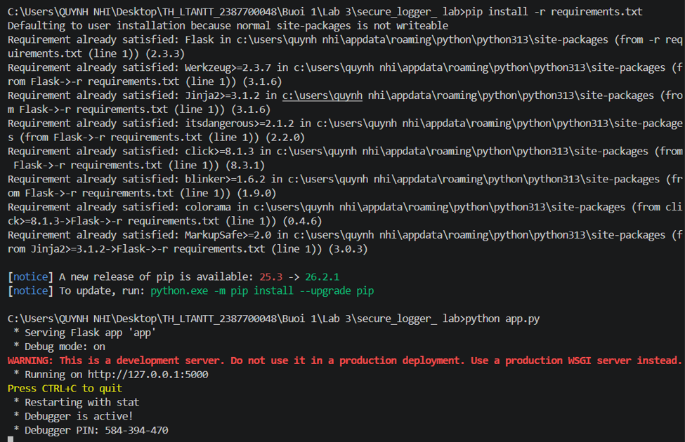
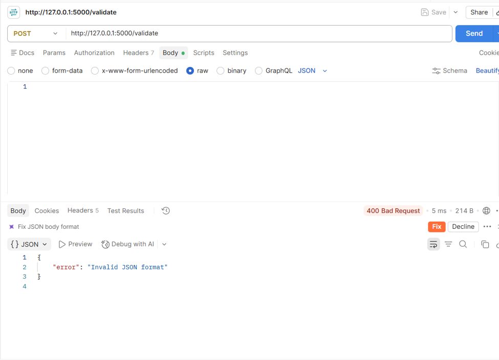
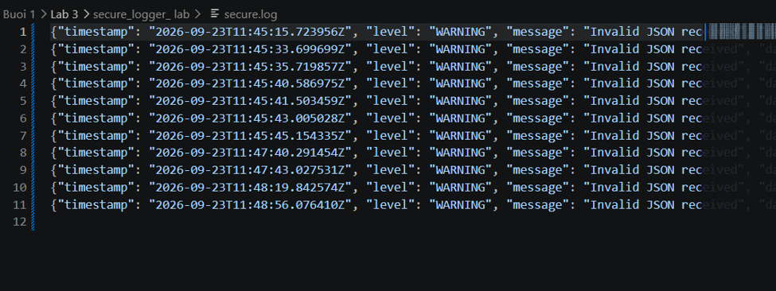
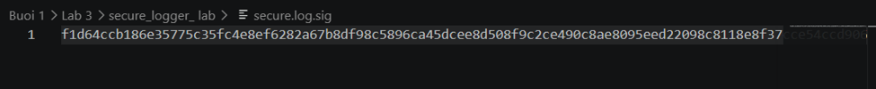

# Báo cáo Kiểm thử và Vận hành Hệ thống Secure Logger Lab

Tài liệu này tổng hợp cấu hình khởi động, các kịch bản kiểm thử (Test Case), phân tích dữ liệu đầu vào (Payload), kỹ thuật bảo mật và cơ chế ghi log kèm chữ ký số từ kết quả thực tế của hệ thống[cite: 13, 14, 15, 16].

---

## 1. Tổng quan Thiết lập và Khởi động Môi trường
* **Cài đặt thư viện:** Chạy lệnh `pip install -r requirements.txt` để cấu hình các gói phụ thuộc (Flask, Werkzeug, Jinja2, v.v.)[cite: 13].
* **Khởi động ứng dụng:** Chạy tệp `app.py` trên môi trường phát triển cục bộ tại địa chỉ `http://127.0.0.1:5000` với chế độ Debug được kích hoạt[cite: 13].

---

## 2. Kịch bản Kiểm thử (Test Cases) & Kết quả Thực tế

| STT | Chức năng / Endpoint | Dữ liệu Đầu vào (Payload) | Mục đích Kiểm thử | Kết quả Thực tế trên Hệ thống | Trạng thái |
| :-- | :-- | :-- | :-- | :-- | :-- |
| 1 | **Khởi chạy Server** | `python app.py`[cite: 13] | Kiểm tra trạng thái hoạt động của ứng dụng Flask | Server chạy thành công tại `http://127.0.0.1:5000`[cite: 13]. | Thành công |
| 2 | **Xử lý JSON (Lỗi)** | Gửi yêu cầu POST tới `/validate` với dữ liệu JSON không hợp lệ/trống[cite: 14]. | Kiểm tra khả năng bắt lỗi định dạng đầu vào của ứng dụng | Trả về mã lỗi `400 Bad Request` kèm thông báo `"error": "Invalid JSON format"`[cite: 14]. | Thành công |
| 3 | **Ghi Log Hệ thống** | Các chuỗi yêu cầu lỗi từ client[cite: 15]. | Kiểm tra cơ chế tự động ghi nhận sự kiện bảo mật | Lưu trữ các bản ghi log cảnh báo (`WARNING`) vào tệp `secure.log` kèm dấu thời gian (timestamp)[cite: 15]. | Thành công |
| 4 | **Ký số tệp Log** | Tệp dữ liệu `secure.log`[cite: 16]. | Kiểm tra tính toàn vẹn của dữ liệu ghi log | Tạo tệp chữ ký số `secure.log.sig` chứa mã băm xác thực bảo mật[cite: 16]. | Thành công |

---

## 3. Giải thích Kỹ thuật Sử dụng và Payload

### 3.1. Kỹ thuật Xác thực Cấu trúc Dữ liệu Đầu vào (JSON Validation)
* **Kỹ thuật:** Ứng dụng sử dụng cơ chế kiểm tra định dạng dữ liệu (Payload Validation) khi nhận yêu cầu qua phương thức `POST` tại đường dẫn `/validate`[cite: 14].
* **Giải thích Payload & Cơ chế tấn công/lỗi:** Khi người dùng gửi lên một payload không đúng chuẩn cú pháp JSON (hoặc thiếu cấu trúc dữ liệu hợp lệ), hệ thống sẽ lập tức phát sinh ngoại lệ, ngăn chặn việc xử lý tiếp theo nhằm tránh lỗi tràn bộ nhớ hoặc tấn công chèn mã độc, đồng thời phản hồi mã `400 Bad Request`[cite: 14].

### 3.2. Kỹ thuật Ghi Log Bảo mật Tự động (Secure Logging)
* **Kỹ thuật:** Mọi sự kiện lỗi hoặc cảnh báo (như lỗi định dạng JSON nhận được) đều được hệ thống tự động ghi lại vào tệp `secure.log`[cite: 15].
* **Giải thích chi tiết:** Mỗi dòng log bao gồm mốc thời gian chi tiết (`timestamp`), cấp độ cảnh báo (`level: WARNING`) và nội dung thông điệp (`message: "Invalid JSON received"`)[cite: 15]. Điều này giúp quản trị viên dễ dàng truy vết các hành vi bất thường hoặc các yêu cầu lỗi từ phía client.

### 3.3. Kỹ thuật Đảm bảo Toàn vẹn Dữ liệu bằng Chữ ký số (Log Signature)
* **Kỹ thuật:** Hệ thống tạo ra một tệp chữ ký số đi kèm (`secure.log.sig`) chứa chuỗi mã băm (hash signature) cho tệp nhật ký[cite: 16].
* **Ý nghĩa bảo mật:** Chữ ký số này đảm bảo rằng tệp `secure.log` không bị kẻ tấn công can thiệp, chỉnh sửa hay xóa dấu vết trái phép. Bất kỳ sự thay đổi nào trên tệp log gốc cũng sẽ làm lệch chuỗi chữ ký số, từ đó phát hiện ngay lập tức hành vi xâm nhập hoặc thao túng dữ liệu hệ thống.
### Hình ảnh kết quả

