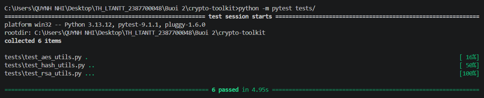
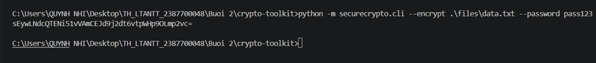
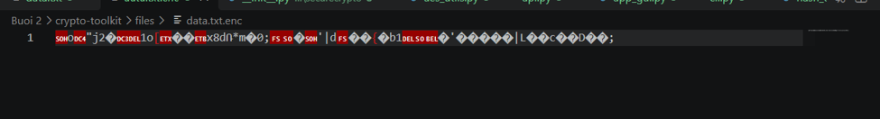
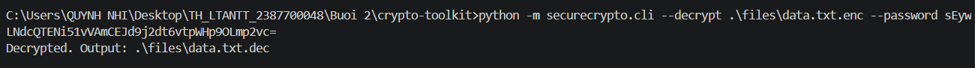
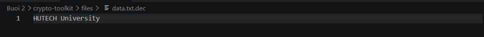
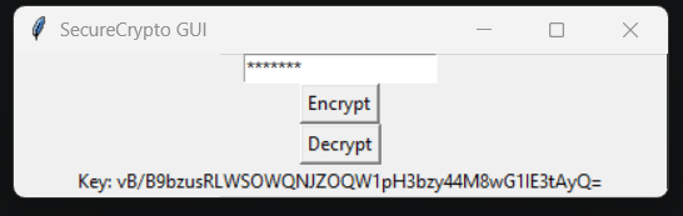
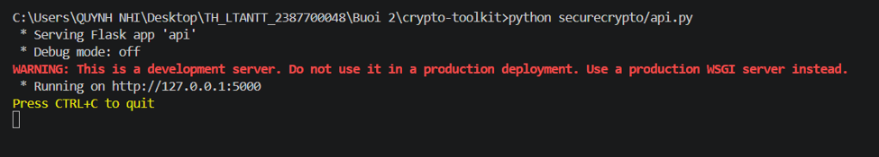
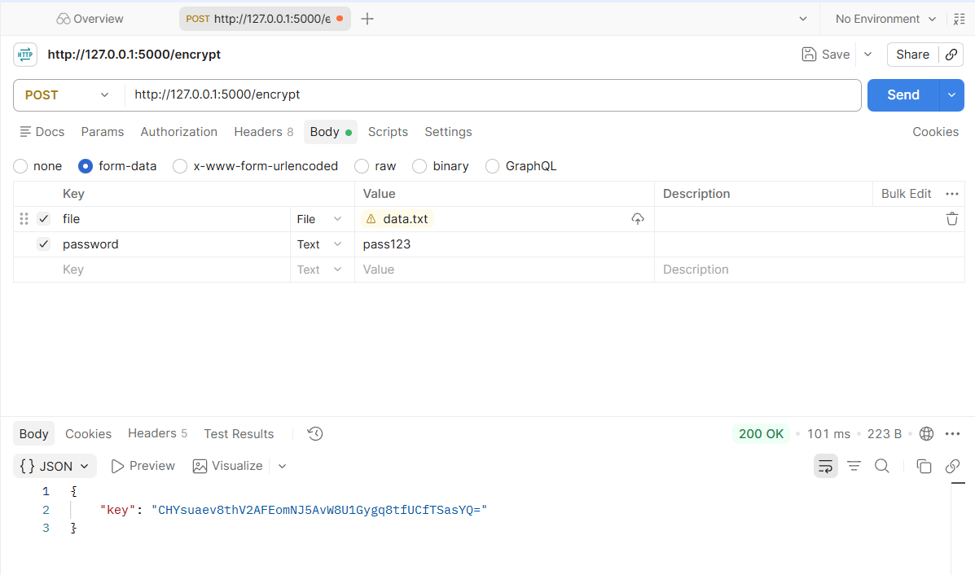
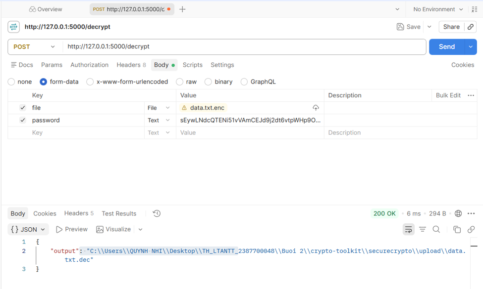

# Báo cáo Kết quả Thực hiện: Công cụ Bảo mật Crypto-Toolkit (`securecrypto`)

## 1. Tổng quan dự án
Dự án **crypto-toolkit** được phát triển nhằm cung cấp các tiện ích mã hóa và an toàn thông tin bằng Python. Phạm vi báo cáo này tổng hợp kết quả thực hiện và kiểm thử trên các giao diện khác nhau của hệ thống: Bộ kiểm thử tự động (Unit Test), Giao diện dòng lệnh (CLI), Giao diện đồ họa (GUI), và RESTful API (Flask).

---

## 2. Kết quả Kiểm thử Tự động (Unit Testing)

* **Kịch bản thực hiện:** Chạy bộ kiểm thử tự động sử dụng `pytest` trên toàn bộ các module chức năng của hệ thống
* **Đầu vào:** Thư mục mã nguồn kiểm thử `tests/`.
* **Kết quả thực hiện:** 
  * Tổng số lượng test case: **6 items** (`test_aes_utils.py`, `test_hash_utils.py`, `test_rsa_utils.py`)
  * Trạng thái: **6 passed** (Thành công toàn bộ trong thời gian 4.95 giây).

---

## 3. Kết quả Thực hiện qua Command Line Interface (CLI)
### 3.1. Chức năng Mã hóa tệp tin (`--encrypt`)

* **Dữ liệu đầu vào:** 
  * Tệp văn bản: `.\files\data.txt` (nội dung: `HUTECH University`).
  * Mật khẩu bảo vệ: `pass123`.
* **Kết quả:** Hệ thống tiến hành sinh khóa, mã hóa tệp tin thành định dạng nhị phân `data.txt.enc` và trả về chuỗi khóa định dạng Base64 trên màn hình dòng lệnh: `sEywLNdcQTENi51vVAmCEJd9j2dt6vtpWHp90Lmp2vc=`

### 3.2. Chức năng Giải mã tệp tin (`--decrypt`)

* **Dữ liệu đầu vào:** 
  * Tệp mã hóa: `.\files\data.txt.enc`.
  * Khóa/Mật khẩu tương ứng.
* **Kết quả:** Hệ thống xác thực và giải mã thành công, xuất ra tệp khôi phục `.\files\data.txt.dec` chứa chính xác nội dung gốc ban đầu là `HUTECH University`.

---

## 4. Kết quả Thực hiện qua Graphical User Interface (GUI)

* **Kịch bản thực hiện:** Khởi chạy ứng dụng giao diện đồ họa qua tệp `app_gui.py`.
* **Thao tác thực hiện:** Nhập mật khẩu bảo vệ vào ô trống, nhấn nút **Encrypt** và chọn tệp dữ liệu cần bảo mật.
* **Kết quả:** Giao diện hoàn tất quá trình mã hóa và hiển thị trực quan chuỗi khóa định dạng Base64 (ví dụ: `vB/B9bzusRLWSOWQNJZOQW1pH3bzy44M8wG1IE3tAyQ=`) trên khung thông tin phía dưới.

---

## 5. Kết quả Kiểm thử RESTful API (Flask & Postman)

* **Trạng thái Server:** Khởi động thành công ứng dụng Flask tại địa chỉ `http://127.0.0.1:5000`.

### 5.1. Test Case API Mã hóa (`POST /encrypt`)

* **Dữ liệu đầu vào (Body - form-data):** 
  * `file`: Tệp `data.txt`.
  * `password`: `pass123`.
* **Kết quả trả về (JSON Response):** Phản hồi mã `200 OK` kèm theo khóa phiên mã hóa:
  {
    "key": "CHYsuaev8thV2AFEomNJ5AvW8U1Gygq8tfUCfTSasYQ="
  }

### 5.2. Test Case API Giải mã (`POST /decrypt`)

* **Dữ liệu đầu vào (Body - form-data):** 
  * `file`: Tệp đã mã hóa `data.txt.enc`.
  * `password`: Khóa hoặc mật khẩu hợp lệ.
* **Kết quả trả về (JSON Response):** Phản hồi mã `200 OK` kèm theo đường dẫn tuyệt đối của tệp đã giải mã thành công trên hệ thống:
  {
    "output": "C:\\...\\securecrypto\\upload\\data.txt.dec"
  }

---

## 6. Giải thích Kỹ thuật Cốt lõi
* **Mã hóa AES-GCM (Galois/Counter Mode):** Là thuật toán mã hóa khối đối xứng kết hợp xác thực (AEAD). Cơ chế này không chỉ bảo mật nội dung tệp tin bằng bản mã mà còn tạo ra một thẻ xác thực (`tag`) để kiểm tra tính toàn vẹn dữ liệu, đảm bảo tệp không bị chỉnh sửa hay giả mạo trong quá trình lưu trữ và truyền tải.
* **Kỹ thuật dẫn xuất khóa PBKDF2HMAC:** Sử dụng hàm băm SHA-256 kết hợp với một chuỗi `salt` ngẫu nhiên (16 bytes) và 100,000 vòng lặp (iterations) để chuyển đổi mật khẩu dạng văn bản thô do người dùng nhập thành một khóa mã hóa có độ dài tiêu chuẩn (32 bytes). Kỹ thuật này giúp bảo vệ tối đa chống lại các hình thức tấn công dò mật khẩu (Brute-force / Dictionary attack).