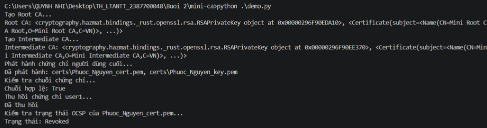
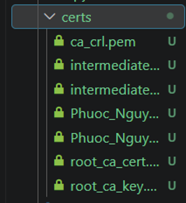
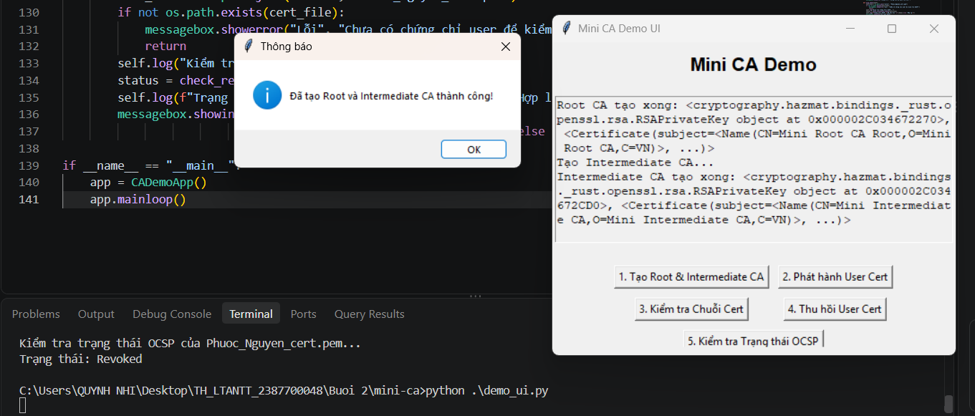
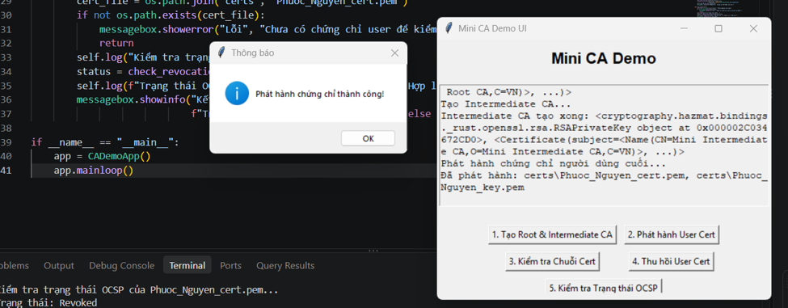
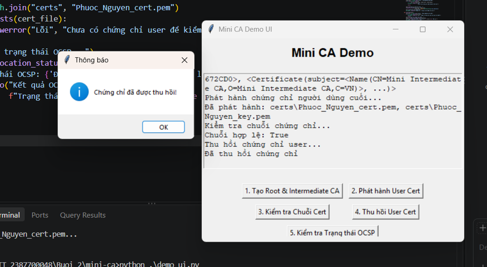
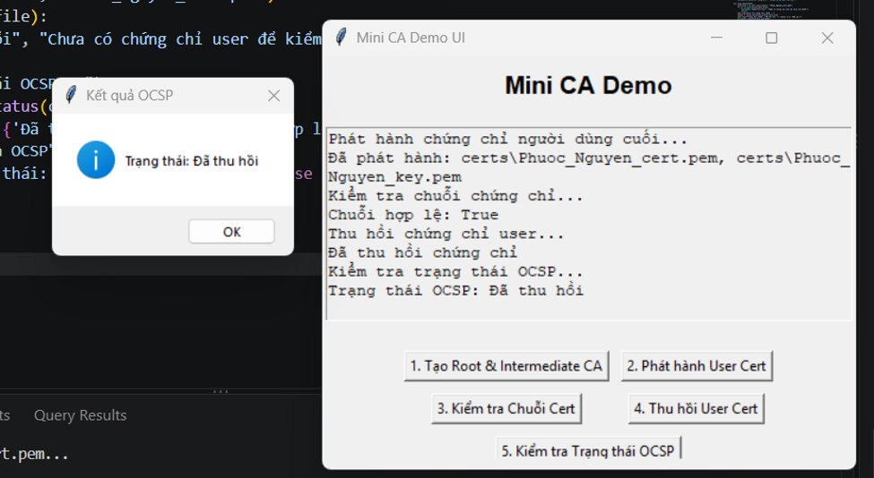

# Báo cáo Thực hành: Xây dựng Hệ thống Quản lý Chứng thư Số (Mini CA)

## 1. Giới thiệu dự án
Dự án này xây dựng một hệ thống Quản lý Chứng thư Số (Mini CA) thu nhỏ sử dụng ngôn ngữ Python và thư viện `cryptography`. Hệ thống cho phép mô phỏng toàn bộ vòng đời của một chứng thư số X.509, bao gồm:
* Khởi tạo **Root CA** và **Intermediate CA**.
* Phát hành chứng chỉ cho người dùng cuối (End Entity).
* Xác thực chuỗi chứng chỉ (Certificate Chain Verification).
* Thu hồi chứng chỉ và quản lý danh sách thu hồi (CRL - Certificate Revocation List).
* Kiểm tra trạng thái thu hồi của chứng chỉ.
* Giao diện đồ họa người dùng (UI) tích hợp bằng `tkinter`.

---

## 2. Kỹ thuật và Công nghệ sử dụng
* **Ngôn ngữ lập trình:** Python.
* **Thư viện mã hóa:** `cryptography` (sử dụng các mô-đun xử lý chuẩn X.509, thuật toán bất đối xứng RSA, hàm băm SHA-256).
* **Giao diện người dùng:** `tkinter` để xây dựng ứng dụng giao diện trực quan (`demo_ui.py`).
* **Cấu trúc dữ liệu chứng chỉ:** Định dạng chuẩn PEM (Privacy-Enhanced Mail) lưu trữ trong thư mục `certs/`.

---

## 3. Các Test Case và Kết quả Thực hiện

Hệ thống đã được kiểm thử thông qua cả dòng lệnh (`demo.py`) và giao diện đồ họa (`demo_ui.py`). Dưới đây là các test case chi tiết:

### Test Case 1: Khởi tạo Root CA và Intermediate CA

* **Mô tả:** Tạo cặp khóa bất đối xứng và chứng chỉ tự ký cho Root CA, sau đó dùng Root CA để ký và cấp phát chứng chỉ cho Intermediate CA.
* **Kỹ thuật áp dụng:** Sử dụng `x509.CertificateBuilder()`, cấu hình `BasicConstraints(ca=True)`, và ký số bằng `hashes.SHA256()`.
* **Kết quả thực hiện:** 
  * Tạo thành công các tệp `root_ca_key.pem`, `root_ca_cert.pem`, `intermediate_key.pem`, và `intermediate_cert.pem` trong thư mục `certs/`[cite: 23].
  * Giao diện hiển thị thông báo: *"Đã tạo Root và Intermediate CA thành công!"*

### Test Case 2: Phát hành Chứng chỉ Người dùng Cuối (End Entity)

* **Mô tả:** Intermediate CA tiến hành cấp phát chứng chỉ số cho người dùng (`Phuoc_Nguyen`) với thông tin định danh (Common Name, Organization, Country).
* **Kỹ thuật áp dụng:** Thiết lập `BasicConstraints(ca=False)` để đảm bảo thực thể cuối không được phép ký chứng chỉ khác, thiết lập thời hạn hiệu lực (365 ngày).
* **Kết quả thực hiện:** 
  * Sinh thành công cặp khóa và chứng chỉ: `Phuoc_Nguyen_key.pem` và `Phuoc_Nguyen_cert.pem`.

### Test Case 3: Kiểm tra Chuỗi Chứng chỉ (Certificate Chain Verification)

* **Mô tả:** Xác thực tính hợp lệ của chứng chỉ người dùng dựa trên chuỗi tin cậy đi qua Intermediate CA và Root CA.
* **Kỹ thuật áp dụng:** Duyệt qua chuỗi chứng chỉ, lấy khóa công khai của tổ chức phát hành để kiểm tra chữ ký số (`issuer_public_key.verify()`) kết hợp với cơ chế đệm `padding.PKCS1v15()`.
* **Kết quả thực hiện:** 
  * Trả về kết quả **`True`**, xác nhận chuỗi chứng chỉ hoàn toàn hợp lệ và đáng tin cậy.

### Test Case 4: Thu hồi Chứng chỉ (Revocation)

* **Mô tả:** Thực hiện thu hồi chứng chỉ của người dùng (`Phuoc_Nguyen_cert.pem`) khi gặp sự cố bảo mật (lộ khóa - `key_compromise`).
* **Kỹ thuật áp dụng:** Tạo và cập nhật Danh sách thu hồi chứng chỉ (CRL) sử dụng `CertificateRevocationListBuilder`, lưu trữ trạng thái vào `ca_crl.pem`.
* **Kết quả thực hiện:** 
  * Chứng chỉ được ghi nhận vào danh sách thu hồi thành công với lý do cụ thể.

### Test Case 5: Kiểm tra Trạng thái Thu hồi (OCSP / Revocation Status Check)

* **Mô tả:** Kiểm tra xem một chứng chỉ bất kỳ có nằm trong danh sách bị thu hồi hay không trước khi cho phép hệ thống chấp nhận.
* **Kỹ thuật áp dụng:** Đọc tệp `ca_crl.pem` và so sánh số sê-ri (`serial_number`) của chứng chỉ cần kiểm tra với danh sách các chứng chỉ đã bị thu hồi.
* **Kết quả thực hiện:** 
  * Hệ thống phát hiện chứng chỉ đã bị thu hồi và trả về trạng thái **`Revoked`** (Đã thu hồi).

---

## 4. Cấu trúc Thư mục Kết quả (`certs/`)
Sau khi chạy hoàn tất các kịch bản kiểm thử, thư mục `certs/` lưu trữ các tệp sau:
* `root_ca_key.pem` / `root_ca_cert.pem`: Khóa và chứng chỉ của Root CA.
* `intermediate_key.pem` / `intermediate_cert.pem`: Khóa và chứng chỉ của Intermediate CA.
* `Phuoc_Nguyen_key.pem` / `Phuoc_Nguyen_cert.pem`: Khóa và chứng chỉ của người dùng cuối.
* `ca_crl.pem`: Danh sách thu hồi chứng chỉ (CRL).