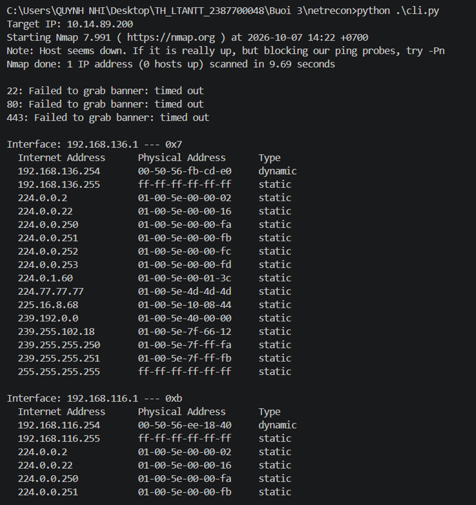
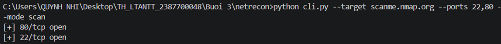
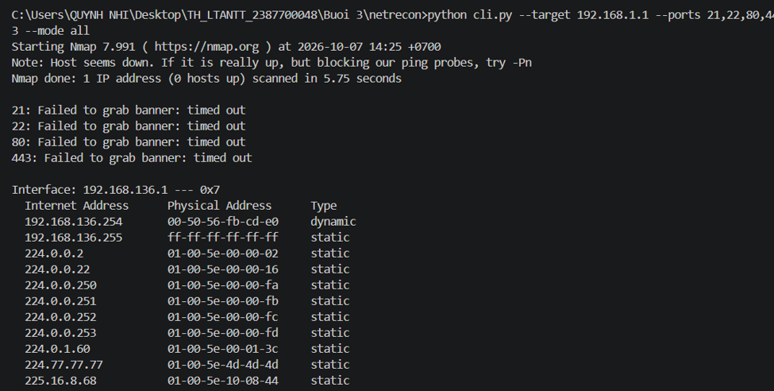
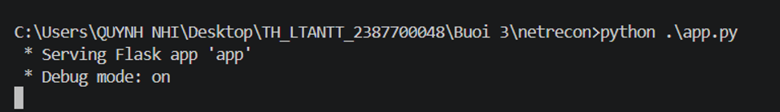
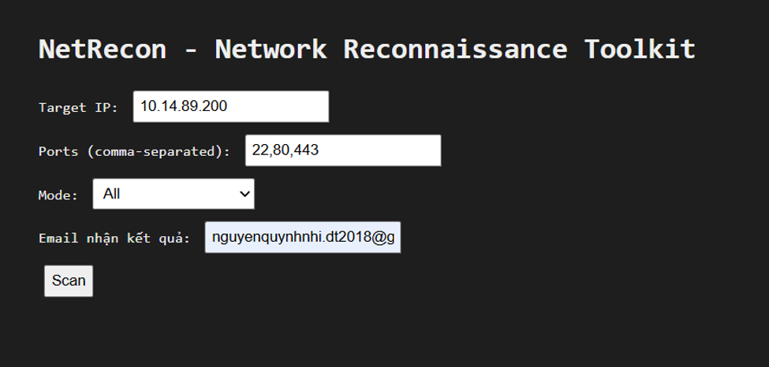
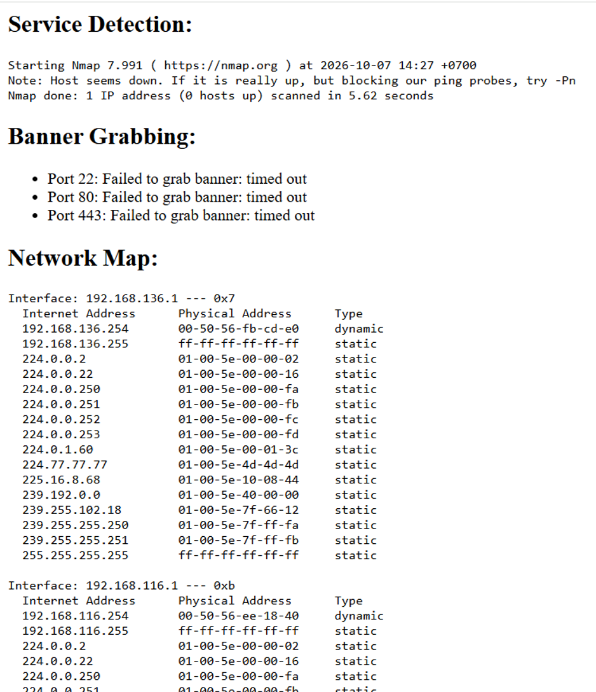
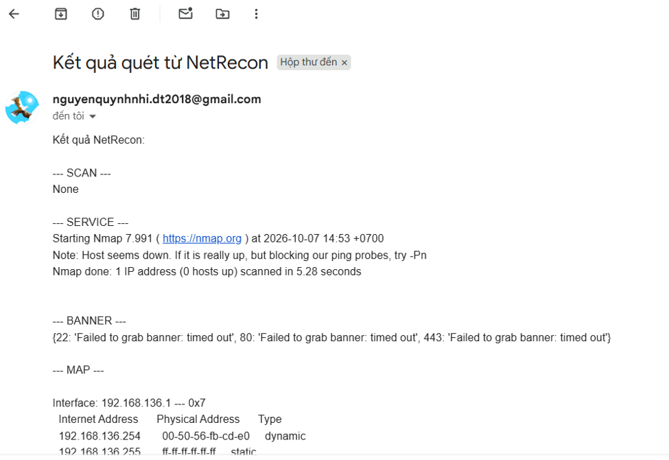

# Báo cáo Thực hành: NetRecon

## 1. Giới thiệu
Dự án này xây dựng một hệ thống công cụ trinh sát mạng (`netrecon`) dạng mô-đun kết hợp giữa giao diện dòng lệnh (**CLI**) và giao diện web (**Flask + HTMX**). Hệ thống cho phép thực hiện các kỹ thuật thu thập thông tin mục tiêu mạng, bao gồm:
- **Quét cổng bất đồng bộ (Asynchronous Port Scanning):** Sử dụng thư viện `asyncio` để tối ưu hóa tốc độ quét các cổng TCP.
- **Phát hiện dịch vụ & Banner Grabbing:** Tích hợp công cụ `nmap` và socket thuần túy để nhận diện chi tiết dịch vụ đang chạy và thông tin banner.
- **Lập bản đồ mạng cục bộ (Network Mapping):** Tự động trích xuất bảng ARP hệ thống (`arp -a`) để phân tích các thiết bị kết nối.
- **Kiểm tra lỗ hổng bảo mật (Vulnerability Checking):** Tra cứu tự động các mã CVE phổ biến dựa trên danh sách cổng dịch vụ mở.
- **Báo cáo tự động qua Email:** Tổng hợp và gửi kết quả quét qua giao thức SMTP bảo mật SSL.

---

## 2. Kỹ thuật và Công nghệ sử dụng
- **Ngôn ngữ lập trình:** Python.
- **Framework & Giao diện:** Flask, HTML5, CSS3, HTMX (cập nhật nội dung bất đồng bộ trên giao diện web).
- **Thư viện mạng và xử lý đồng thời:** 
  - `asyncio` và `socket`: Xử lý mạng bất đồng bộ, kiểm tra trạng thái cổng nhanh chóng bằng giới hạn luồng (`Semaphore`).
  - `subprocess`: Gọi các lệnh hệ thống như `nmap` và lệnh lấy bảng định tuyến/ARP.
  - `smtplib` và `email`: Tự động hóa việc soạn thảo và gửi báo cáo kết quả quét qua email mã hóa SSL.
- **Thư viện CLI:** `click` hỗ trợ xây dựng các câu lệnh tương tác linh hoạt qua terminal.

---

## 3. Các Test Case và Kết quả Thực hiện

Hệ thống đã được kiểm thử thông qua cả môi trường dòng lệnh (`cli.py`) và ứng dụng web Flask (`app.py`). Dưới đây là các test case chi tiết:

### Test Case 1: Quét Cổng qua Giao diện Dòng lệnh (CLI Port Scan)

- **Mô tả:** Sử dụng lệnh `python cli.py --target scanme.nmap.org --ports 22,80 --mode scan` để kiểm tra trạng thái mở/đóng của các cổng dịch vụ trên mục tiêu từ xa[cite: 25, 27].
- **Kỹ thuật áp dụng:** Sử dụng `asyncio.Semaphore` quản lý giới hạn tốc độ kết nối đồng thời qua `async_scan_ports`.
- **Kết quả thực hiện:** 
  * Kết quả trả về thành công các cổng đang mở: `[+] 80/tcp open` và `[+] 22/tcp open`

### Test Case 2: Kiểm thử Toàn diện chế độ All qua CLI (All-in-One Mode)

- **Mô tả:** Chạy kịch bản tổng hợp với lệnh `python cli.py --target 192.168.1.1 --ports 21,22,80,443 --mode all` kết hợp kiểm tra banner, dịch vụ và định tuyến mạng.
- **Kỹ thuật áp dụng:** Tích hợp tiến trình `nmap` kết hợp cơ chế bắt lỗi `subprocess.CalledProcessError` và xử lý ngoại lệ timeout khi bắt banner (`banner_grabber.py`).
- **Kết quả thực hiện:** 
  * Hệ thống thực thi quét dịch vụ nmap, ghi nhận thông báo lỗi timeout khi cổng không phản hồi (ví dụ: `21: Failed to grab banner: timed out`).
  * Trích xuất thành công thông tin bảng ánh xạ giao diện mạng từ hệ thống cục bộ (`Interface: 192.168.136.1` kèm bảng `Internet Address` và `Physical Address`)

### Test Case 3: Triển khai Giao diện Web Flask và Khởi chạy Ứng dụng

- **Mô tả:** Khởi động ứng dụng web với lệnh `python .\app.py`, hệ thống kích hoạt máy chủ Flask ở chế độ Debug (`Running on http://0.0.0.0:5000`) và hiển thị giao diện nhập thông tin quét.
- **Kỹ thuật áp dụng:** Sử dụng Flask Blueprint/Routes kết hợp template Jinja2 (`index.html`, `layout.html`) và các thuộc tính định danh HTTP của HTMX (`hx-post="/scan"`).
- **Kết quả thực hiện:** 
  * Giao diện web trực quan với bảng điều khiển chọn mục tiêu IP, danh sách cổng, chế độ quét và địa chỉ email nhận kết quả.

### Test Case 4: Xử lý Báo cáo Kết quả và Gửi Email Tự động

- **Mô tả:** Sau khi người dùng nhấn nút `Scan` trên giao diện web, hệ thống tổng hợp toàn bộ kết quả từ các module (quét cổng, nhận diện dịch vụ, ánh xạ mạng, kiểm tra lỗ hổng) và tự động gửi email thông báo qua máy chủ SMTP của Google.
- **Kỹ thuật áp dụng:** Sử dụng module `email.message.EmailMessage` và `smtplib.SMTP_SSL` cổng `465` với thông tin xác thực bảo mật lấy từ tệp cấu hình môi trường `.env`.
- **Kết quả thực hiện:** 
  * Hiển thị chi tiết các phần kết quả trên trang `result.html`: `Service Detection`, `Banner.
  
  - **Mô tả:** Sau khi hoàn tất tiến trình phân tích từ các mô-đun (quét cổng bất đồng bộ, nhận diện dịch vụ qua nmap, thu thập banner và ánh xạ mạng), hệ thống tự động soạn thảo nội dung báo cáo và chuyển tiếp về địa chỉ email định danh (`nguyenquynhnhi.dt2018@gmail.com`).
- **Kỹ thuật áp dụng:** Sử dụng module `smtplib.SMTP_SSL` kết hợp mã hóa bảo mật cổng `465` với tài khoản xác thực qua biến môi trường (`.env`), định dạng chuỗi kết quả theo từng phần khối (`--- SCAN ---`, `--- SERVICE ---`, `--- BANNER ---`, `--- MAP ---`).
- **Kết quả thực hiện:** 
  * Hộp thư người dùng nhận thành công thông báo với tiêu đề: *"Kết quả quét từ NetRecon"*.
  * Nội dung email hiển thị chính xác toàn bộ bản ghi dữ liệu thực thi: trạng thái quét cổng, phản hồi từ Nmap (ghi nhận trạng thái host block ping probes), kết quả bắt banner các cổng (22, 80, 443 trả về trạng thái thời gian chờ `timed out`), và bảng định tuyến ánh xạ giao diện mạng cục bộ (`Interface: 192.168.136.1`)