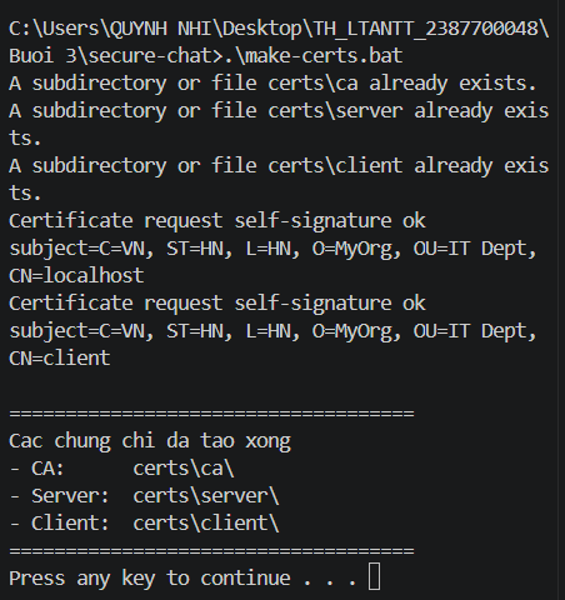
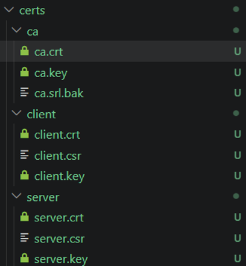
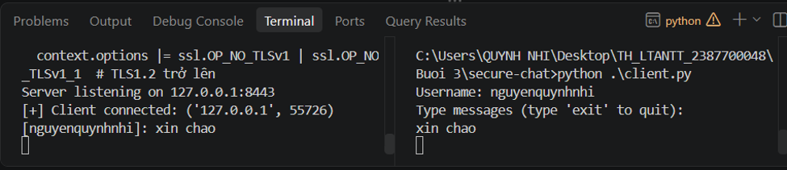
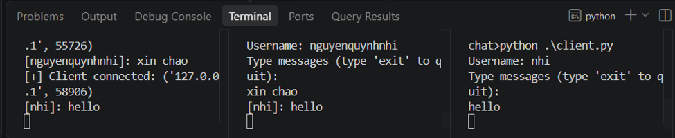

# Báo cáo Thực hành: SECURECHAT

## 1. Giới thiệu
Dự án này xây dựng một hệ thống ứng dụng chat thời gian thực bảo mật (`secure-chat`) giữa **Server** và nhiều **Client** trên nền tảng Python. Hệ thống tích hợp các cơ chế bảo mật mạng hiện đại nhằm đảm bảo tính bảo mật, toàn vẹn và xác thực dữ liệu trên đường truyền, bao gồm:
- **Xác thực và Mã hóa kênh truyền (Transport Layer Security - TLS):** Sử dụng chứng chỉ số X.509 do một Certificate Authority (CA) tự tạo để thiết lập kết nối SSL/TLS hai chiều (Mutual TLS / Client-Server Authentication).
- **Mã hóa ứng dụng đầu cuối (Application-layer End-to-End Encryption):** Sử dụng thuật toán đối xứng **AES-256 (chế độ CBC kết hợp đệm PKCS#7)** với khóa riêng biệt cho từng phiên kết nối để mã hóa nội dung tin nhắn.
- **Quản lý kết nối và Phòng chat đa luồng (Multi-threading):** Xử lý đồng thời nhiều client kết nối, hỗ trợ điều phối tin nhắn qua `ConnectionManager` và `RoomManager`.

---

## 2. Kỹ thuật và Công nghệ sử dụng
- **Ngôn ngữ lập trình:** Python.
- **Thư viện mã hóa và mạng:** 
  - `ssl` và `socket`: Thiết lập kết nối mạng bọc tầng bảo mật TLS 1.2/1.3.
  - `cryptography` (mô-đun `hazmat`): Xử lý mã hóa khối AES-256, padding PKCS#7 và sinh dữ liệu ngẫu nhiên an toàn (`os.urandom`).
  - `threading`: Xử lý đa luồng giúp server lắng nghe và nhận/gửi tin nhắn song song với nhiều client không bị nghẽn.
- **Hạ tầng khóa công khai (PKI):** Sử dụng công cụ dòng lệnh **OpenSSL** để xây dựng CA nội bộ, ký và cấp phát chứng chỉ cho Server và Client.

---

## 3. Các Test Case và Kết quả Thực hiện

Hệ thống đã được cấu hình, sinh chứng chỉ, khởi chạy và kiểm thử thành công qua môi trường dòng lệnh/terminal. Dưới đây là các test case chi tiết:

### Test Case 1: Khởi tạo Hạ tầng CA và Cấp phát Chứng chỉ

- **Mô tả:** Sử dụng tập lệnh tự động hóa `make-certs.bat` kết hợp với tệp cấu hình `openssl.cnf` để khởi tạo cấu trúc thư mục `certs/`, tạo Root CA, chứng chỉ cho Server (`localhost`) và Client (`client`).
- **Kỹ thuật áp dụng:** Lệnh OpenSSL cấu hình RSA 2048-bit, chữ ký số `sha256`, mở rộng `v3_ca` cho CA và thiết lập SAN/Subject Distinguished Name cho Server/Client.
- **Kết quả thực hiện:** 

  * Tạo thành công các tệp khóa và chứng chỉ: `ca.crt`, `ca.key`, `server.crt`, `server.key`, `client.crt`, `client.key` trong thư mục `certs/`.
  * Terminal hiển thị thông báo xác nhận: *"Certificate request self-signature ok"* và *"Cac chung chi da tao xong!"*.

### Test Case 2: Khởi động Server Bảo mật (SSL/TLS Server)
- **Mô tả:** Chạy chương trình `server.py` để lắng nghe kết nối tại `127.0.0.1:8443` với cấu hình yêu cầu bắt buộc chứng chỉ từ phía Client (`ssl.CERT_REQUIRED`) và vô hiệu hóa các phiên bản TLS cũ không an toàn (TLSv1, TLSv1.1).
- **Kỹ thuật áp dụng:** `ssl.create_default_context()`, `context.load_cert_chain()`, và `context.wrap_socket(server_side=True)`.
- **Kết quả thực hiện:** 

  * Server khởi động thành công và hiển thị trạng thái: `Server listening on 127.0.0.1:8443`.

### Test Case 3: Kết nối và Xác thực Client (Mutual Authentication)
- **Mô tả:** Khởi chạy `client.py`, tiến hành nhập tên định danh (`Username`), khởi tạo khóa phiên AES-256 ngẫu nhiên và thực hiện bắt tay SSL/TLS với Server bằng chứng chỉ của client.
- **Kỹ thuật áp dụng:** Gửi kèm chuỗi định danh kết hợp mã hóa khóa AES dưới dạng hex (`binascii.hexlify`) qua kênh an toàn SSL cho Server xác thực và quản lý.
- **Kết quả thực hiện:** 
  * Server ghi nhận kết nối thành công từ client với thông báo: `[+] Client connected: ('127.0.0.1', 55726)` kèm theo cổng giao tiếp tương ứng.

### Test Case 4: Truyền thông Tin nhắn Mã hóa Thời gian thực (Encrypted Chat Broadcasting)
- **Mô tả:** Các client gửi tin nhắn văn bản; nội dung được mã hóa cục bộ bằng AES-256 trước khi đẩy lên server, sau đó server chuyển tiếp và phân phối tới các client khác trong phòng chat dưới dạng bản mã đã được mã hóa lại bằng khóa riêng của từng người nhận.
- **Kỹ thuật áp dụng:** Sử dụng luồng riêng biệt (`threading.Thread`) để nhận tin nhắn ngầm (`receive_messages`), kết hợp lớp `MessageEncryption` để giải mã và hiển thị lên màn hình.
- **Kết quả thực hiện:** 

  * Tin nhắn được truyền nhận thành công giữa các bên (ví dụ: client `nguyenquynhnhi` gửi `xin chào`, client `nhi` nhận và phản hồi `hello`).
  * Server hiển thị rõ log luồng thông điệp theo định dạng `[Username]: nội dung`.

---

## 4. Cấu trúc Thư mục Dự án (`secure-chat/`)
Sau khi hoàn tất quá trình thiết lập và chạy thử nghiệm, cấu trúc thư mục dự án gồm các thành phần:
- `certs/ca/`: Chứa `ca.crt`, `ca.key` (Chứng chỉ và khóa của cơ quan cấp phát).
- `certs/server/`: Chứa `server.crt`, `server.key`, `server.csr` (Chứng chỉ và khóa của máy chủ).
- `certs/client/`: Chứa `client.crt`, `client.key`, `client.csr` (Chứng chỉ và khóa của máy khách).
- `server.py`: Mã nguồn chương trình Server xử lý kết nối SSL và điều phối tin nhắn.
- `client.py`: Mã nguồn chương trình Client giao tiếp qua giao diện dòng lệnh.
- `message_encryption.py`: Thư viện xử lý mã hóa/giải mã AES-256 CBC.
- `connection_manager.py` & `room_manager.py`: Quản lý danh sách kết nối và phòng chat đa luồng.
- `make-certs.bat`: Kịch bản tự động hóa quá trình sinh chứng chỉ bằng OpenSSL.